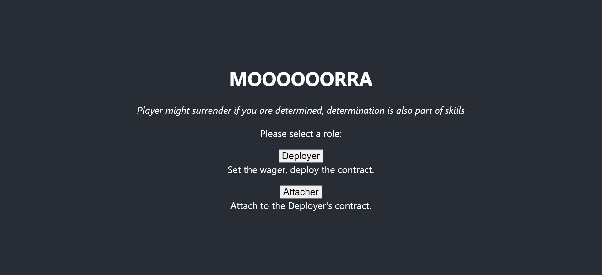
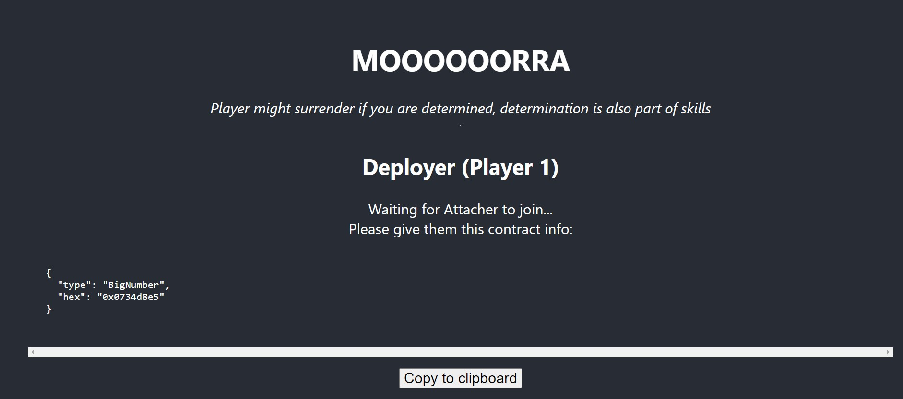
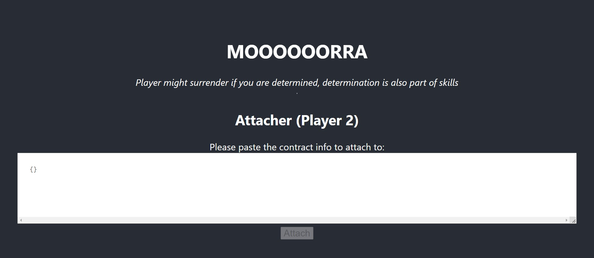
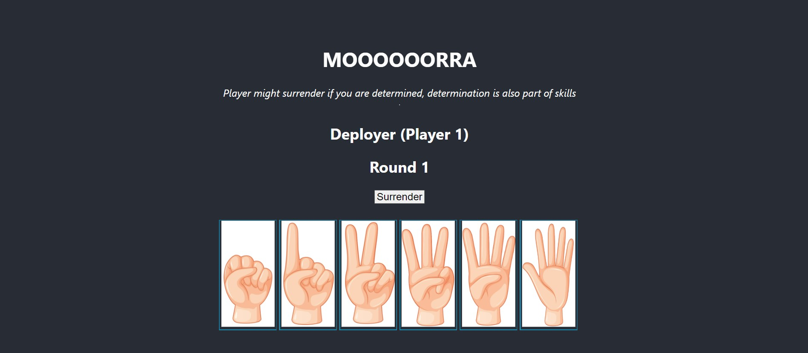
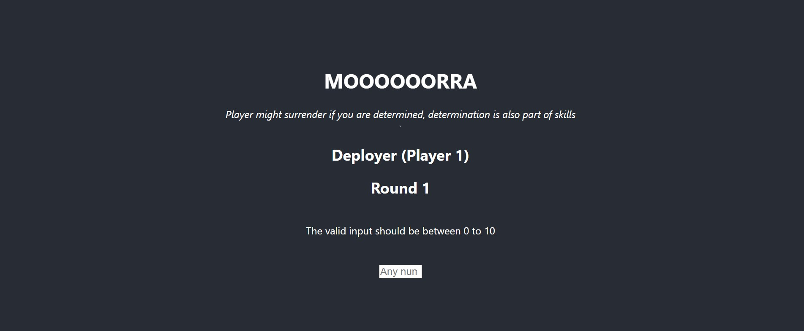
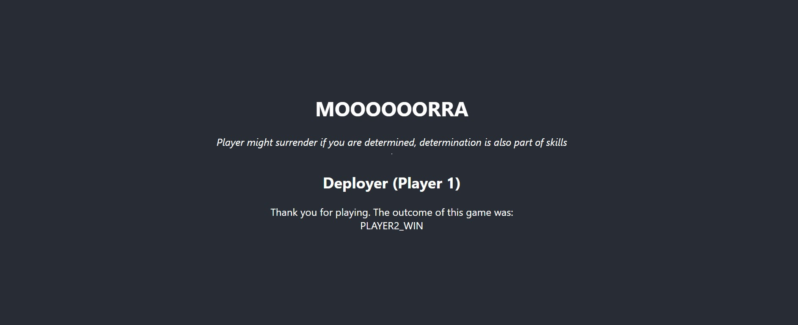

# Morra-blockchain
<h1>Blockchain Game - Morra</h1>
A simple Morra Game modified using the "Rock, Paper, Scissor" source code from official reach (https://docs.reach.sh/tut/rps/#tut).
The game is develop using Reach as backend and React as frontend.

<h2>How to play?</h2>
Select your role:  

 Deployer share the contract:  

 Attacher attach to the contract:  

 Select your finger:  

 Guess the total:  

 See the WINNER:  

Visit here to play: https://morra-blockchain.vercel.app/
